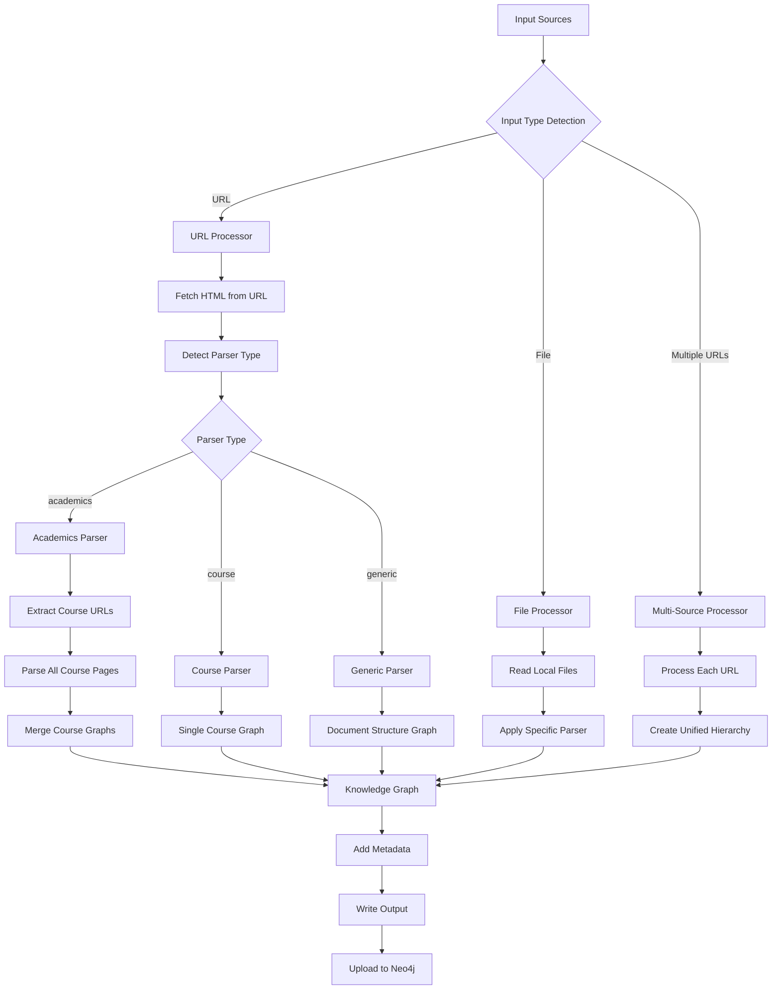
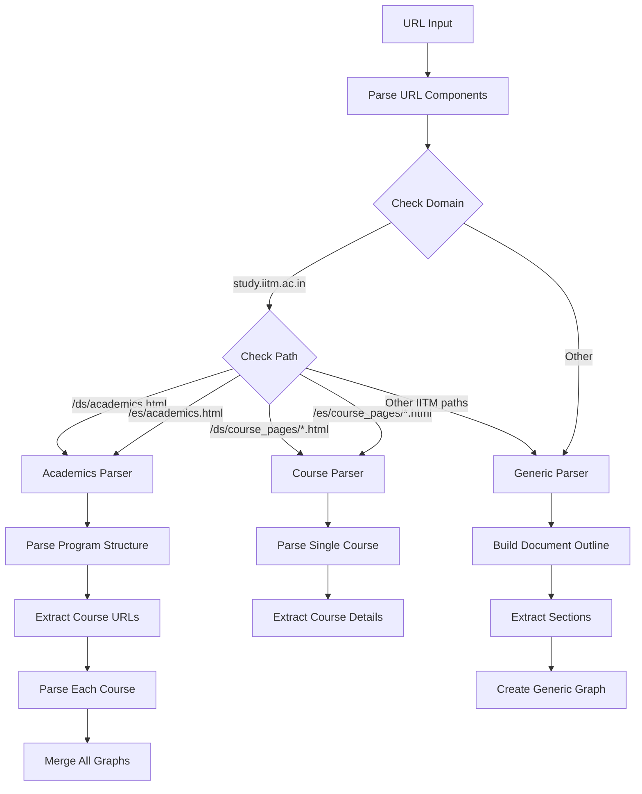
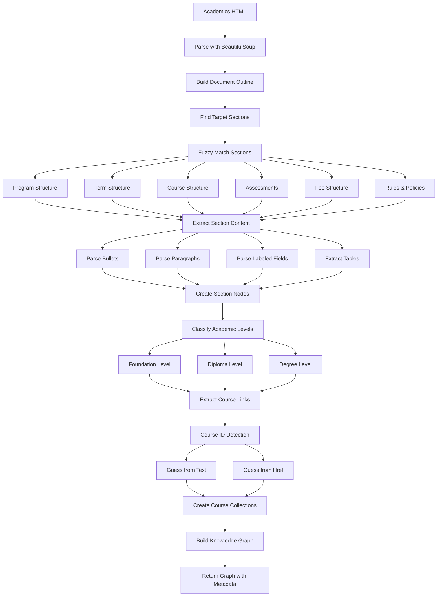
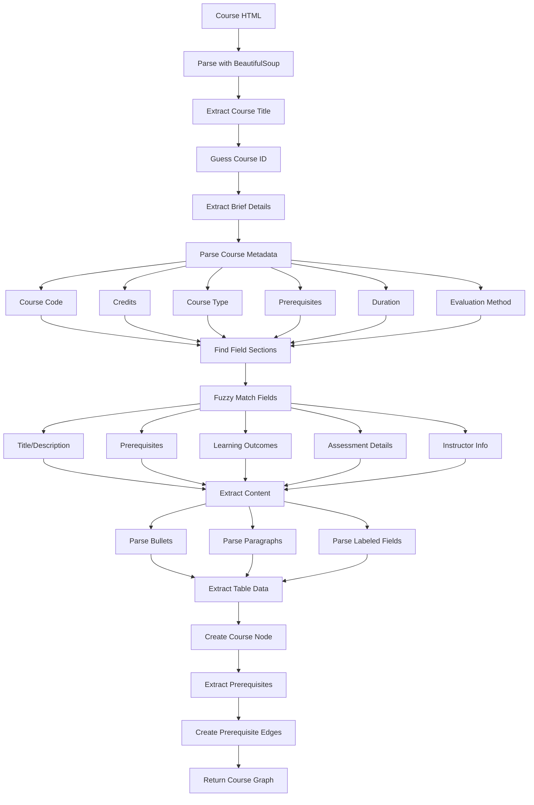
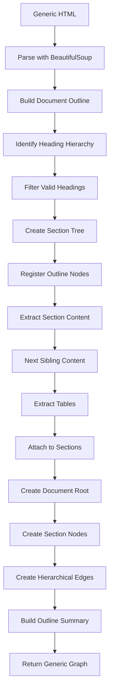
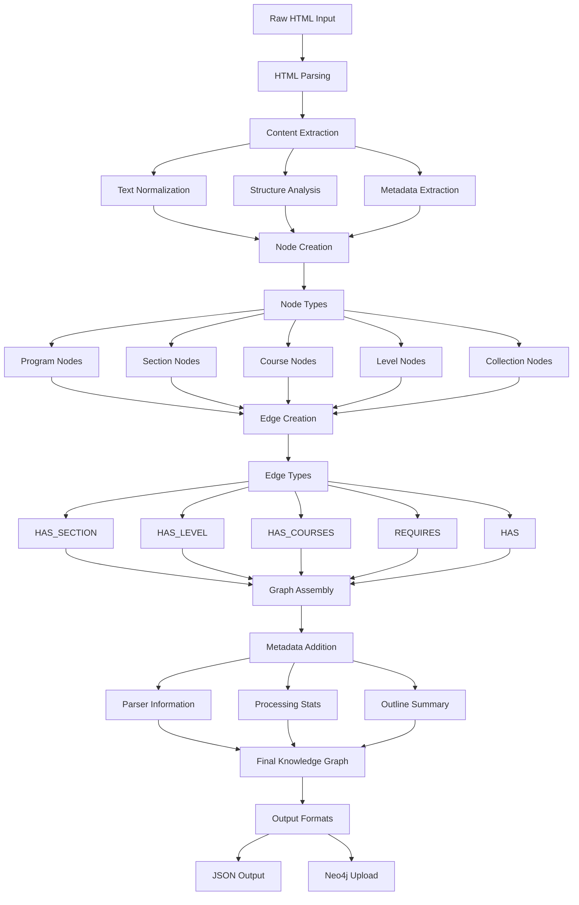
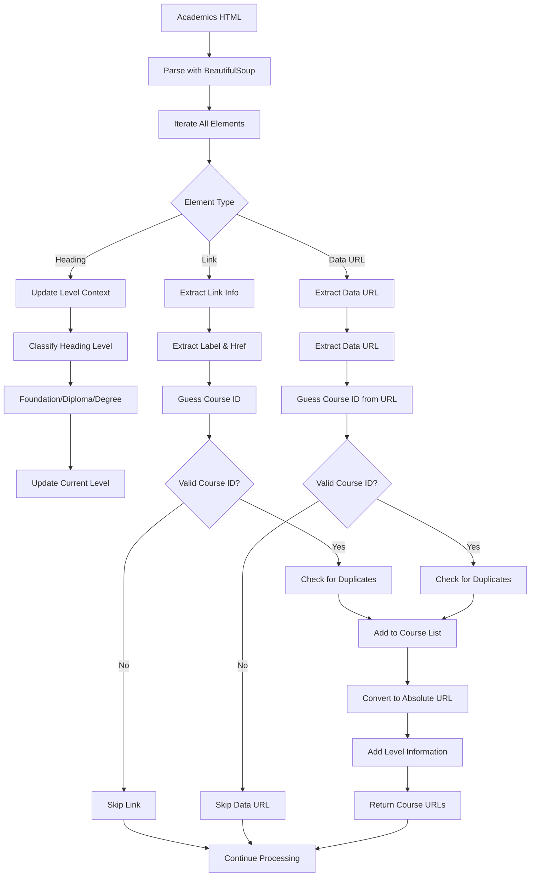
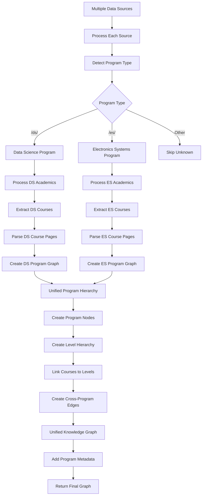

# IITM BS Xplore - Parsing Logic Diagrams

This document contains Mermaid diagrams that explain the parsing logic and data flow in the IITM BS Xplore knowledge graph extraction system.

## 1. Main Parsing Flow Architecture

## 2. Parser Detection and Routing

## 3. Academics Parsing Logic

## 4. Course Parsing Logic

## 5. Generic HTML Parsing Logic

## 6. Data Flow and Knowledge Graph Construction

## 7. Course URL Extraction Process

## 8. Multi-Source Processing Flow

## Key Components Explained

### Parser Types
- **Academics Parser**: Handles program structure pages with course listings
- **Course Parser**: Processes individual course detail pages
- **Generic Parser**: Handles any other HTML documents with outline structure

### Node Types
- **Program**: Root program nodes (IITM BS Degree Program)
- **Level**: Academic levels (Foundation, Diploma, Degree)
- **Section**: Document sections with content
- **Course**: Individual course nodes with metadata
- **Collection**: Lists of courses or other items

### Edge Types
- **HAS_SECTION**: Hierarchical section relationships
- **HAS_LEVEL**: Program to level relationships
- **HAS_COURSES**: Level to course collections
- **REQUIRES**: Course prerequisite relationships
- **HAS**: General containment relationships

### Key Features
- **Fuzzy Matching**: Uses rapidfuzz for flexible section matching
- **Course ID Detection**: Multiple strategies for extracting course identifiers
- **Hierarchical Structure**: Maintains document and academic hierarchies
- **Metadata Preservation**: Tracks parsing statistics and source information
- **Error Handling**: Graceful handling of parsing failures
