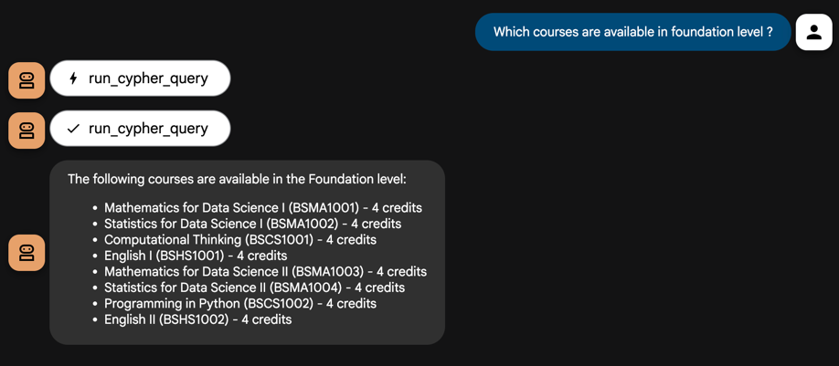
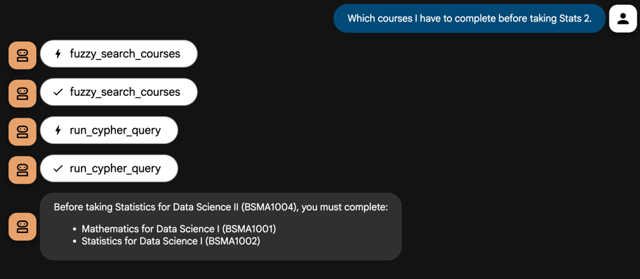
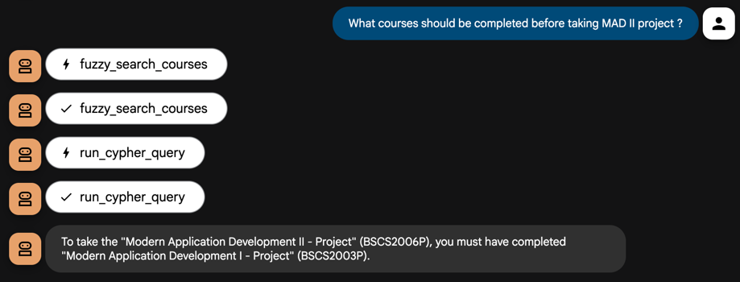
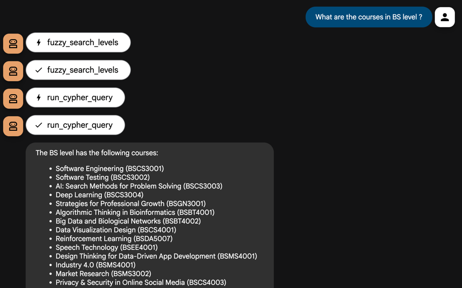
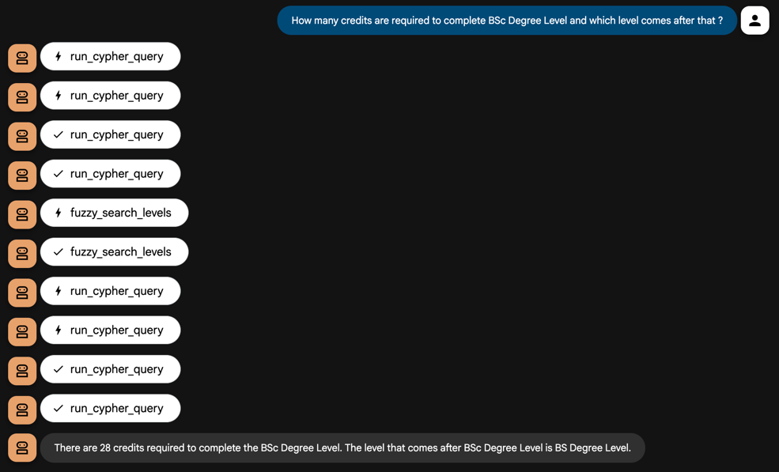
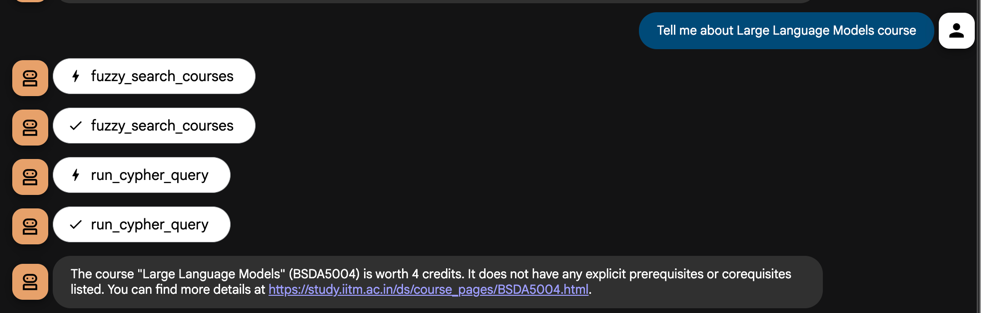

# 🧠 IITM Online Degree Simple Knowledge Graph

This project implements a **Knowledge Graph (KG)** for the IITM Online Degree program, built on **Neo4j**.  
Instead of attempting to generalize across arbitrary academic structures, this KG follows a **fixed, schema-driven approach** — tightly aligned with the IITM website structure and program design.

---

## ⚙️ Design Philosophy

Instead of generic and flexible, this one **takes the opposite approach** — it is **deliberately fixed in structure**.

### ✅ Advantages

- **Reliability and consistency**:  
  Since the schema is known and constant, queries can be written with complete confidence in structure and relationships.
- **Ease of reasoning**:  
  The KG mirrors IITM’s actual academic hierarchy (levels, courses, prerequisites, etc.), so it’s intuitive for both humans and LLM agents to navigate.
- **LLM-friendly querying**:  
  Because relationships are explicit and standardized, LLMs can easily generate Cypher queries to fetch structured academic data.

### ⚠️ Trade-offs

- **Dependency on website structure**:  
  Because the data is extracted from IITM’s academic site, if the HTML structure changes (e.g., class names, table layouts), corresponding updates will be required in the scraper functions.
- **Tight coupling**:  
  This design sacrifices flexibility for accuracy — it is not meant to automatically adapt to arbitrary institutional data.

In short, this KG is **opinionated but dependable** — built for precision over adaptability.

---

## 🧩 Knowledge Graph Schema

The graph consists of two primary **node types** and several **relationship types**.

### 🏷️ Node Types

#### 1. `Level`

Represents an academic level (e.g., Foundation, Diploma in Programming, PG Diploma, etc.)

| Property | Type | Description |
|-----------|------|-------------|
| `name` | String | Level name (unique identifier) |
| `credits_required` | Integer | Total credits required to complete this level |

#### 2. `Course`

Represents an individual course that belongs to one or more levels.

| Property | Type | Description |
|-----------|------|-------------|
| `code` | String | Unique course code (e.g., BSMA1001) |
| `name` | String | Full course name |
| `credits` | String | Number of credits |
| `details_link` | String | URL to IITM’s official course page |
| `meta_data` | String | Optional metadata (e.g., { "type": "PROJECT" }) |

### 🔗 Relationship Types

| Relationship | From → To | Description |
|-----------|------|-------------|
| `HAS_COURSE` | (Level) → (Course) | Links a level to its courses. |
| `HAS_PREREQUISITE` | (Course) → (Course) | Defines prerequisite dependencies between courses. |
| `HAS_COREQUISITE` | (Course) → (Course) | Defines courses that must be taken together. |
| `PROGRESS_TO` | (Level) → (Level) | Defines progression order (e.g., Foundation → Diploma → BSc → BS → PG Diploma → M.Tech). |

## List Courses

## Fuzzy Search on course name and query for Prerequisite

## Fuzzy Search on level name

## Credit and level progression

## Course Details
